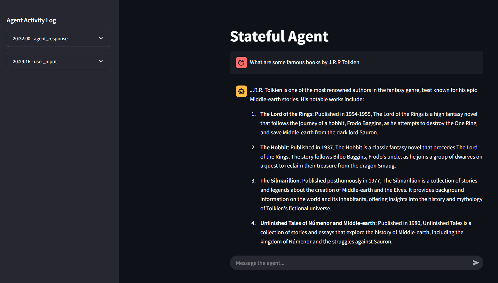

# Stateful Agent
A simple, self-contained stateful agent built purely in Python. <br/>

 

This project implements an agent that maintains its own persistent memory, integrates external tools (Web search and Wikipedia search), and interfaces with Ollama (LLM agnostic) — all without relying on frameworks like LangGraph or Agno.


# Overview
Modern large language models (LLMs) are powerful, but they are inherently stateless — every interaction is isolated, and they cannot learn from experience beyond the data encoded in their weights. Inspired by the idea that the future of AI lies in stateful agents—systems that form persistent memories and learn over time—this project aims to push beyond traditional LLM-driven workflows.

## What Makes This Agent “Stateful”?

- **Persistent Memory**:
Utilizes _FAISS_ for efficient similarity search and stores memory in JSON format, allowing the agent to remember past interactions.

- **Integrated Tools**:
Comes with built-in capabilities for web search and Wikipedia search to fetch real-time data and enrich its knowledge base.

- **LLM-Agnostic Interface**:
Works with Ollama (Langchain support) to interact with any LLM, ensuring flexibility and adaptability.

- **Logging System**:
Detailed logging provides transparency into the agent’s decision-making and memory updates.

# Motivation
Most LLM-based systems act as static workflows with no ability to learn from new experiences.

_"Large language models possess vast knowledge, but they're trapped in an eternal present moment... The next major advancement in AI won't come from larger models, but from LLM-driven agents that can actually learn from experience."_

This project is a step towards that vision, creating an agent that:

- Maintains a persistent identity.
- Actively forms and updates memories based on interactions.
- Continuously learns and adapts from its experiences.

# Features
**Memory Module**:
Uses FAISS for quick and efficient storage and retrieval of memories, backed by a JSON-based storage system.

**Tool Integration**:

- **Web Search**: Quickly fetches current data from the web.
- **Wikipedia Search**: Retrieves detailed, structured information for enriched responses.
- **LLM Integration**: Interfaces with Ollama, making the agent compatible with multiple LLMs.
- **Logging**: Comprehensive logging for monitoring behavior, debugging, and future enhancements.

# Getting Started
## Prerequisites
> Python 3.11 or higher

### Installation
Follow the instructions below:


```bash
conda create -n agent python=3.11
conda activate agent
git clone https://github.com/reddheeraj/Stateful_Agent.git
cd Stateful_Agent
pip install -r requirements.txt
```

- Set up [SERPAPI](https://serpapi.com/) API key needed for web search.
- Install Ollama from [here](https://ollama.com/) if you don't have it yet.
### Running the Agent
Simply execute:
```bash
streamlit run app.py
```
This will start the agent, initialize its memory module, and begin processing interactions while logging its activity.

# Future Work
- Migrate from FAISS to a vectorDB like ChromaDB, LanceDB or Qdrant, or Postgres.
- Integrate more sophisticated techniques to refine how the agent learns from its accumulated state.
- Expand tool integration to include more data sources and processing capabilities.

# Contributing
Contributions are welcome! If you have ideas, improvements, or bug fixes, please fork the repository and submit a pull request.

# License
This project is licensed under the MIT License.

